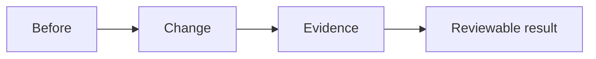

## Summary

Describe the runtime, rendering, simulation, validation, or workflow change in prose. Explain why this is the right slice of the roadmap instead of only listing files.

## Issues

- Addresses #

## Diagram

## Visual Evidence

Attach screenshots, GIFs, or generated diagrams here when pixels, scene alignment, lighting, frame pacing, or UI behavior changed.

## Validation

- [ ] `.\scripts\verify-roadmap-gates.ps1`
- [ ] GPU validation, if intentionally required: `.\scripts\verify-roadmap-gates.ps1 -RunGpuKernels -AcceptBugcheckRisk`
- [ ] Live viewport capture, if visual behavior changed
- [ ] Trace/profiler output, if performance behavior changed

## Remaining Issues

List remaining visual, performance, safety, or architecture gaps. Do not hide incomplete roadmap work behind a vague success statement.
